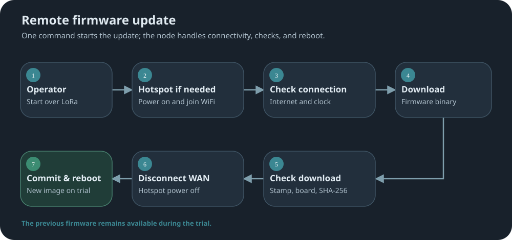
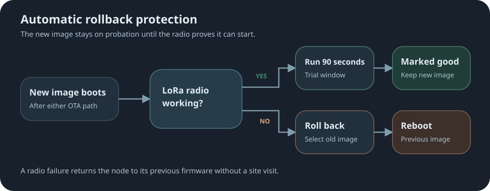

# hotspot-ota

[↩ Back to firmware readme](../../README.md)

## Fully Remote Firmware Updates

MeshCore already has a built-in `start ota` command. It starts a WiFi access point on the
device for a nearby upload. With `hotspot-ota`, a remote CLI command over the LoRa mesh
can instead power a connected hotspot if needed, join WiFi, download firmware from a URL,
verify it, and install it.

After either update path, the new firmware must start successfully before it is accepted.
If startup fails, the node boots the previous working firmware.



MeshCore's own local `start ota` still works too, with a long list of fixes. See
[Local Access Point](#4-local-access-point---start-ota).

### First remote update

Save the WiFi network and firmware URL, then verify the connection before starting an update:

```text
set ota.wan.wifi MyHotspot,hunter2
set ota.fw.url https://tools.mobmesh.org/flasher/bin/repeater/heltec_v4.bin
ota wan verify
start ota wan update
get ota.status
```

Use the URL for this node's board and role. `ota wan verify` checks internet and time-server
access without starting an update; `get ota.status` shows download progress or the result.
After setup, later updates need only `start ota wan update`.

---

## 1. Hardware Requirements

Only the hotspot power control needs extra hardware: a switch on a GPIO pin that powers a
WiFi hotspot or cell modem. The node turns it on for an update and off again afterwards, so
a cellular hotspot has **zero idle (vampire) draw** between updates. That matters on a solar
or battery node.

> [!TIP]
> **No hotspot needed if WiFi is already in range.** Save the network with `set ota.wan.wifi`
> and the node joins it directly. The power switch and hotspot are only for sites with no WiFi.

The pin is held high for the whole update, not pulsed, so a load-switch enable line has to
stay asserted and should have a pulldown. See `variants/<board>/README.md` for each board's
pin. Rollback protection and clock sync need no extra hardware.

The node switches the hotspot off at every startup, before the radio starts, and before any
reboot it triggers itself, so a reset or crash never leaves a modem drawing current. Where
[`power-guard`](../power-guard) is also installed, the hotspot is not powered while the
battery is below its resume mark: `ota wan join`, `ota wan verify` and updates reply
`ERR: battery low; hotspot not powered`. `set ota.wan.pwr on` is not held back.

---

## 2. CLI Commands

All of these work over serial or remotely over the mesh. Full details are in
[`docs/cli-additions.md`](docs/cli-additions.md).

<table>
<thead><tr><th align="left">Command</th><th align="left">What it does</th></tr></thead>
<tbody>
<tr><td><code>set ota.wan.wifi &lt;ssid&gt;,&lt;password&gt;</code></td><td>Save the WiFi network to use. Survives firmware updates.</td></tr>
<tr><td><code>set ota.fw.url &lt;url&gt;</code></td><td>Save a default firmware URL.</td></tr>
<tr><td><code>set ota.fw.marker &lt;on|off&gt;</code></td><td>Turn the build-stamp check off for the next update only. See below.</td></tr>
<tr><td><code>get / set ota.wan.pwr</code></td><td>Read or switch the hotspot power directly.</td></tr>
<tr><td><code>get ota.wan.health</code></td><td>Show the latest verification and whether this WiFi setup has succeeded before.</td></tr>
<tr><td><code>get ota.wan.radio</code></td><td>Show ESP32 WiFi, driver, and link state alongside the <code>ota.wan.pwr</code> value.</td></tr>
<tr><td><code>get ota.status</code></td><td>Current step, download progress, or the final result.</td></tr>
<tr><td><code>get ota.slot</code></td><td>Version and state of both slots.</td></tr>
<tr><td><code>ota wan survey</code></td><td>List nearby WiFi networks and whether each is open, keeping the strongest result per name and security state. Scans once; paging shows the same result.</td></tr>
<tr><td><code>ota wan survey &lt;offset&gt;</code></td><td>Show results from <code>&lt;offset&gt;</code> onward, as <code>next N</code> suggests.</td></tr>
<tr><td><code>ota wan survey refresh</code></td><td>Throw the old result away and scan again.</td></tr>
<tr><td><code>ota wan join</code> / <code>ota wan leave</code></td><td>Join WiFi without downloading, or disconnect and cut hotspot power.</td></tr>
<tr><td><code>ota wan check</code></td><td>After a manual <code>ota wan join</code>, check whether the node can reach the internet.</td></tr>
<tr><td><code>ota wan verify</code></td><td>Test WAN and NTP, then restore the current WiFi and hotspot-power state. Success marks the setup proven good for automatic NTP refresh in sync.time campaigns.</td></tr>
<tr><td><code>ota cancel</code></td><td>Stop an update any time before it starts verifying.</td></tr>
<tr><td><code>ota slot boot &lt;A|B&gt;</code></td><td>Boot the other slot, if it holds a valid image.</td></tr>
<tr><td><code>start ota wan &lt;url&gt;</code></td><td>Join WiFi, download from <code>&lt;url&gt;</code>, check it, and install it.</td></tr>
<tr><td><code>start ota wan update</code></td><td>Same, using the saved <code>ota.fw.url</code>.</td></tr>
</tbody>
</table>

> [!IMPORTANT]
> `set ota.fw.marker off` lets the next update install firmware without this project's build stamp.
> If the target firmware lacks remote OTA, the node will lose its ability to update remotely.
> Restoring that ability will require an on-site visit to flash it by hand.

If you don't know the network name, `ota wan survey` lists what the node can hear. A padlock
marks a protected network; open ones leave that column blank. Results last two minutes, so
paging through them costs nothing, and `ota wan survey refresh` starts a fresh scan. A name too
long for `set ota.wan.wifi` to hold is marked, because the node can see more than it can store:

```text
ota wan survey
  -> 🔒 0 MyHotspot -54 dBm
     🔒 1 Library-Staff -72 dBm
        2 Library-Guest -74 dBm
     next 3
```

The survey only looks. It never joins, never powers the hotspot, and refuses while the OTA
access point is up, the node is already joined, or an update is running.

---

## 3. How an Update Runs

`start ota wan` replies `OK - OTA queued` right away and runs in the background, so the node
keeps repeating while it works. It takes up to about two minutes. Cancel any time before
verifying with `ota cancel`; on a cancel or failure the current firmware keeps running and
`get ota.status` shows what happened.

To save data, the node decides from the first 1 KB whether a download is worth finishing, and
hangs up straight away if the image is:

| Problem | Reply |
| --- | --- |
| Not a MobMesh build | `no H0TSP0T metadata -- not a build of this project` |
| A build without hotspot-ota | `image has no OTA support` |
| For a different board or role | `image is for X, this node is Y` |
| The firmware already running | `already running vX (sha) -- nothing to do` |

A good image downloads in full and is then checked against its SHA-256. The SHA-256 and the
build stamp catch a corrupt download or the wrong image; they do not prove who published it.

---

## 4. Local Access Point - Start OTA

MeshCore's `start ota` turns the node into a WiFi access point so someone nearby can upload
firmware from a phone or laptop. This mod replaces it with a tighter version:

- **New commands:** `stop ota` closes the access point, and `get ota.ap` shows whether it's up
  and how long it has left.
- **It doesn't stay up forever.** It closes itself after 20 minutes, or 10 minutes after an
  upload stalls. Stock leaves an open upload page running until a reboot.
- **It won't start at a bad moment:** not during probation, not during a remote update.
- **It protects the upload.** `reboot`, `poweroff` and `erase` are refused while it writes.
- **A better upload page** shows the node's name, battery and slots, can set the clock, and
  checks the firmware file before sending anything.

<details>
<summary>📂 <b>Upload fixes and file checks</b> <sub>(click to expand)</sub></summary>

| Stock MeshCore | This mod |
| --- | --- |
| The MD5 is never actually checked. | The MD5 the page sends is checked. |
| A second upload can collide with the first. | One upload at a time. |
| A rejected upload can still look like a success. | Every failure returns a real error. |
| Reboots before the browser hears back. | Replies first, so the page shows "Update complete". |
| A stalled upload leaves the flash writer locked. | A stalled upload is cleared. |
| New firmware is trusted immediately. | New firmware goes on probation. |

The page blocks a file that can't be read, is too small, is a full-flash image, is for a
different chip, or won't fit the slot. It warns, and needs **I know what I'm doing** ticked,
when the file has no MobMesh stamp, is for a different board or role, or matches the running
version.

</details>

---

## 5. Automatic Rollback Protection

Stock MeshCore halts when the radio won't start, and the node stays dead until someone
visits. This mod gives new firmware a trial period instead:



- Works after either update path, with no extra hardware.
- `poweroff` is refused during the trial, since sleeping then would roll back a good update.
- A radio failure with no recent update gets a few quick retries, then the node deep-sleeps
  and tries again on each wake, backing off to once every 15 minutes.

---

## 6. Automatic Clock Sync

Whenever the node joins WiFi for OTA, `ota wan join` or `ota wan verify`, it also sets its
clock from `us.pool.ntp.org` (falling back to `pool.ntp.org`). A
[`sync-settings`](../sync-settings/docs/time.md) time publisher uses `ota wan verify` to
refresh its own clock before it broadcasts. These boards lose the time on every reboot, and the
[`timing-safety`](../timing-safety) mod explains why that matters. If the time server doesn't
answer, the update carries on.

[↩ Back to firmware readme](../../README.md)
