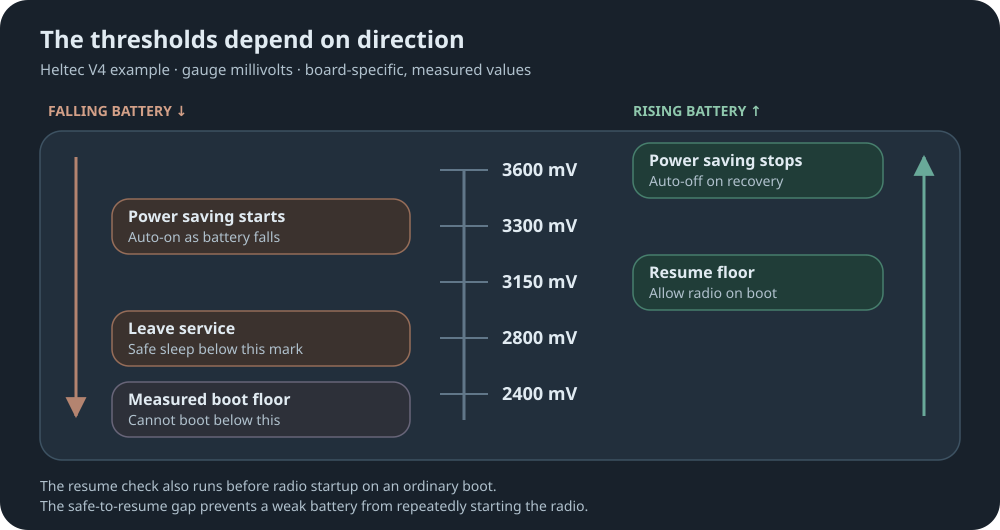
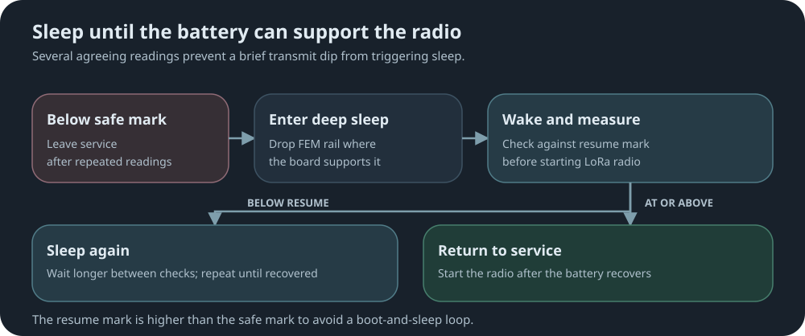

# power-guard

[↩ Back to firmware readme](../../README.md)

Takes a repeater out of service before the battery browns it out, and brings it back
when the pack recovers. Also drops the LoRa FEM rail in deep sleep, which upstream
leaves powered: ~4 mA against ~14 uA, the difference between a solar pack climbing back
at dawn and a node flat by morning.

**Repeater only.** Nothing here has anything to switch on a room server.

## The Ladder

Every board sets its own thresholds. The heltec_v4 values below are an example, not a
default to copy -- they come from bench measurement.
The power-saving steps apply when `powersaving auto` is on; safe sleep is controlled
separately by `powersaving safe`.

The order matters: the safe mark must sit below the resume mark, or a node leaves service
and immediately qualifies to run again.

After leaving service, the node checks the battery before powering the radio on each wake.
If it is still below the resume mark, it sleeps again with progressively longer intervals.
Several agreeing readings are required before a transition, so a transmit dip cannot trigger one.

Values are gauge millivolts, not volts at the pins.

## CLI Commands

Detailed syntax, responses, and restrictions are in the
[CLI reference](docs/cli-additions.md).

<table>
<thead><tr><th align="left">Command</th><th align="left">What it does</th></tr></thead>
<tbody>
<tr><td><code>powersaving safe</code></td><td>Show on/off, threshold, and last reading.</td></tr>
<tr><td><code>powersaving safe.mv &lt;mv&gt;</code></td><td>Set the threshold, or <code>0</code> to disable.</td></tr>
<tr><td><code>powersaving safe on|off</code></td><td>Toggle the failsafe, leaving the threshold alone.</td></tr>
<tr><td><code>powersaving auto</code></td><td>Show state, active flag, and transition count.</td></tr>
<tr><td><code>powersaving auto on|off</code></td><td>Toggle automatic power saving.</td></tr>
<tr><td><code>poweroff &lt;secs&gt;</code></td><td>Deep sleep for 60 to 86400 seconds, then wake. Works over the mesh too.</td></tr>
<tr><td><code>stats-core</code></td><td>Battery, uptime, errors, queue length.</td></tr>
<tr><td><code>stats-radio</code></td><td>Noise floor, RSSI/SNR, airtime.</td></tr>
<tr><td><code>stats-packets</code></td><td>Packet counters.</td></tr>
</tbody>
</table>

Upstream's `poweroff` never wakes. This replaces it with a version that requires a wake time
and refuses a bare `poweroff`. Over the mesh, the reply goes out first and the node sleeps
5 seconds later. Builds without this mod refuse `poweroff` altogether.

The three `stats-` commands are upstream's own, gated to serial there. This mod forwards
them when they arrive over the mesh, so a remote operator can read a battery level without
a site visit. The remote CLI path is already authenticated and the replies only read state.

It also rebases the clock after a brownout, which upstream leaves scrambled until NTP
or a battery pull corrects it.

With [`hotspot-ota`](../hotspot-ota), power-guard blocks automatic hotspot power below the
resume mark. A shim hook keeps the mods independently selectable.

## Enabling

Add `power-guard` to a target's `mods:` in `build-targets.yaml`, then set the board's
thresholds in `variants/<board>/overrides.yaml`. **Every voltage defaults to 0, meaning
off** -- a threshold is a fact about a board's divider and measured boot floor, so a
board that states nothing gets a mod that does nothing. Power saving additionally needs
`POWER_GUARD_AUTO_DEFAULT` or `powersaving auto on`.

| Threshold | Board override |
| --- | --- |
| Start power saving on falling voltage | `POWER_GUARD_AUTO_ON_MV` |
| Leave service on falling voltage | `POWER_GUARD_SAFE_MV` |
| Resume the radio after leaving service | `POWER_GUARD_RESUME_MV` |
| Stop power saving on rising voltage | `POWER_GUARD_AUTO_OFF_MV` |

Optionally bypasses the FEM LNA while power saving
(`POWER_GUARD_AUTO_DROP_FEM_LNA: 1`, off by default): about 9 mA saved at idle on a Heltec V4
(bench, 2026-09-16) for ~10 dB of RX sensitivity. Off by default because a repeater that
hears less than it advertises is a routing hazard.

Requires the `battery_measurement` capability; `fem_lna_control` and
`deep_sleep_rail_shutdown` are optional.

[↩ Back to firmware readme](../../README.md)
