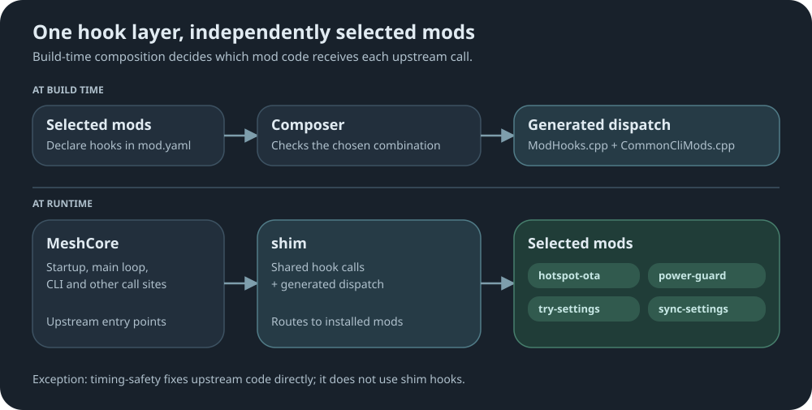

# shim

## Mod Hooks for MeshCore Upstream

Most mods need upstream MeshCore to call their code at the right moment: at startup,
on every pass of the main loop, when a CLI command comes in, and so on. Rather than
have every mod patch upstream on its own, `shim` adds those call points once and
every other mod plugs into them.

On its own, shim changes one thing. Build it with no other mods and you get firmware that
behaves like upstream, except that `poweroff` and `shutdown`, which never wake, are refused
unless a mod such as power-guard provides a version that does.

## What it touches

A single patch adds the call points to the repeater's and room server's `main.cpp`
and `MyMesh.cpp`. That's the only place any mod reaches into upstream code, and a
test makes sure it stays that way.

`timing-safety` is the exception: it fixes upstream code directly instead of adding
anything, so it doesn't need shim.

## Keeping up with upstream

`patch-drift-canary` checks shim's upstream patch every day:

- **Does it still apply?** The patch is tried against upstream's `main` and `dev`
  branches. If it doesn't fit, the report shows where the code moved and whether git
  could place it on its own or someone needs to step in.
- **Does it still build?** Applying cleanly isn't enough, since upstream could rename
  or remove something shim calls. So the patched `dev` tree also gets compiled, with
  the most mods each role ships.
- **Is it still needed?** Key upstream PRs are watched for a merge. Once one lands,
  the shim hooks it would replace get a second look.

Any of these opens an issue. Release builds run the same apply check, and a failure
there stops the build.

## How mods plug in

Each mod lists the call points it wants in its `mod.yaml`. At build time, the composition
tool reads those lists and generates the code that connects everything. The mods you pick decide
what gets wired in and in what order.

A few ground rules:

- **CLI commands:** mods get first look, ahead of upstream's own commands.
- **One owner:** some jobs, like radio setup or region handling, can only belong to one mod.
- **No surprises at runtime:** a mix of mods that doesn't fit together fails the build,
  not the node.
- **Keys stay put:** mods can ask the firmware to sign things, but they never see its
  private key.
- **Vetoes combine:** where several mods may refuse something, such as powering a heavy
  load, every one must agree. With no such mod installed it is allowed, so no mod depends
  on another.
