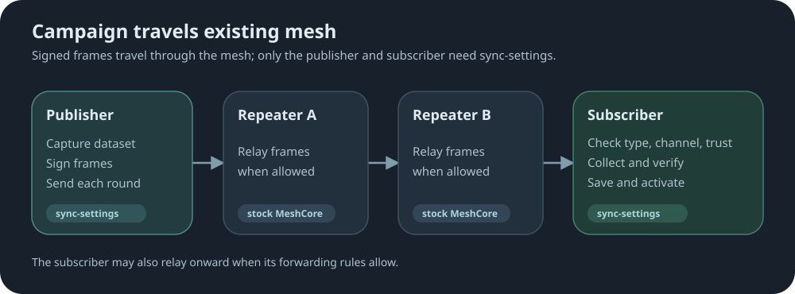
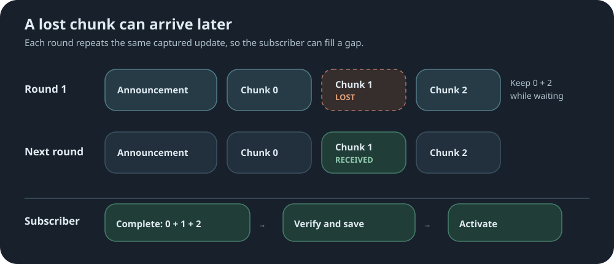
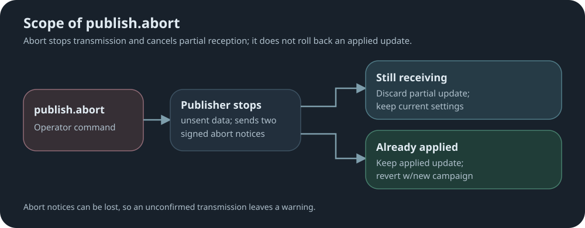

# sync-settings

Repeaters can subscribe to [trusted publishers](#trusted-publishers) that send periodic
region lists and selected operating settings over the mesh. After an operator
trusts a publisher and enables a campaign type, the repeater applies received updates.
A disconnected repeater must receive a later update to catch up.

## At a glance

Each campaign type has its own README. Select a campaign name below for its setup,
commands and behavior.

| Campaign | What a subscriber receives |
|---|---|
| [**Region**](docs/region.md) | A managed overlay of region names and forwarding rules. |
| [**Policy**](docs/policy.md) | Selected operating settings for its area. |
| [**Radio**](docs/radio.md) | A coordinated move to new LoRa frequency, bandwidth, spreading factor or coding rate. |
| [**Time**](docs/time.md) | Signed clock samples to repair an unset or drifting clock. |

- **Publishing:** needs no subscription; each publish command names its own channel.
- **Relaying:** stock MeshCore repeaters carry campaigns without the mod.

To subscribe, [trust a publisher](#trusted-publishers), choose a
[channel](#subscription-channels), and enable the campaign types this repeater should accept.

## Campaigns

Every update travels as a **campaign**: a publisher captures a dataset once, signs it,
and floods it across the mesh in repeated rounds over a set period. Region, policy and
radio are three kinds of campaign carried by the same machinery. [Time](docs/time.md) uses the
same carrier, trust and channels, but each sample is a single fresh signed frame.

### Efficient by design

Most settings updates need just **two LoRa messages per round**: a signed announcement
and one data chunk. Policy settings and radio plans each fit in a single chunk, as do
small region lists. Compression is used when it saves at least one message.
Time campaigns only use one signed message per broadcast.

### How a campaign moves



- Each round is an announcement followed by one or more chunks.
- Only publishers and subscribers need `sync-settings`; every relay can run stock MeshCore.
- Relaying follows local forwarding rules; a denied route can stop a flood.
- Subscribers also pass traffic onward when local rules allow it.
- A campaign is scoped to a region or to `*`, unscoped.
- Publication acknowledgement means started—not delivered to every subscriber.

### Repeated rounds and missing data



- Every round resends the same captured update, not later local edits.
- Missing chunks can be recovered from a later round while reception remains active.
- A lost announcement costs that whole round.
- An already-applied update is not applied again.
- A reboot stops publishing; a saved guard prevents immediate republishing.

### Running campaigns together

- Region and policy campaigns can run at the same time, independently of each other.
- Time samples run alongside region and policy campaigns.
- A radio campaign runs alone: while it is active, no region or policy campaign can start
  or be accepted, and time samples wait.

## Subscribing

A repeater accepts a campaign only when all three hold:

1. the campaign type is turned on;
2. the campaign's channel matches the repeater's channel; and
3. the publisher's full public key is in the trusted list.

```text
sync.publisher add <full-public-key>
set sync.channel release
sync.region on
sync.policy on
sync.radio on
sync.time on
```

Turn on any combination of campaign types the installed build supports.

### Trusted Publishers

- Trust is by complete 64-character hexadecimal public key.
- One trusted list covers region, policy, radio and time campaigns.

| Command | Effect | When to use it |
|---|---|---|
| `sync.publisher remove <key>` | Revoke trust and cancel that publisher's inbound work. Keep its record and remembered campaign generations. | Stop accepting its campaigns while retaining protection against old updates if the key is added again. |
| `sync.publisher forget <key>` | Delete the removed publisher's record and generation history, freeing its slot. Requires `remove` first. | Discard the record entirely or free space in the publisher table. |

Removed keys still occupy slots in the 16-record publisher table. To trust a removed key
again, use `sync.publisher add <key>`; its remembered generations remain in effect.
If the key was also forgotten, adding it again starts without that history, so old
campaigns may become eligible for acceptance again.

Neither command undoes settings already applied by that publisher. `forget` can be
refused while recovery or replay settlement is pending.

### Subscription Channels

A channel lets one publisher run separate streams—for example `release` for the whole
mesh and `early` for a few test repeaters. A subscriber hears only its own channel.

- 1–16 letters, digits, `-` or `_`; uppercase becomes lowercase.
- Examples: `release`, `early`, `policy1`.
- Channel labels are not secret keys.
- Changing the channel requires every sync feature off and no inbound work in progress.

### Commands

Detailed syntax, responses, and restrictions for all campaign types are in the
[CLI reference](docs/cli-additions.md).

| Command | What it does |
|---|---|
| `get sync.channel` | Show receive channel. |
| `set sync.channel <channel>` | Save channel. |
| `sync.publisher list [offset]` | List trusted keys; zero-based offset, up to two per reply. |
| `sync.publisher add <full-public-key>` | Trust a publisher. |
| `sync.publisher remove <full-public-key>` | Revoke trust and cancel its inbound work; keep replay history. |
| `sync.publisher forget <full-public-key>` | After removal, erase its record and replay history. |

## Region and policy publishing

Shared by [region](docs/region.md) and [policy](docs/policy.md) campaigns
([radio](docs/radio.md) and [time](docs/time.md) campaigns are special and use their own
commands).
Replace `<dataset>` with `region` or `policy`.

- Initial schedule: every `12h` over `3d`, seven rounds, starting immediately.
- Region and policy keep independent schedules; a change affects the next publication.
- There is no restore or rollback command.
- Region publications also accept `-empty` to authorize sending an already-empty overlay.
  This clears subscribers' managed overlays. `publish.reset` serves a separate purpose:
  generation-history recovery; it does not clear regions by itself.

| Command | What it does |
|---|---|
| `sync.<dataset> publish <region\|*> <channel> [-raw]` | Capture and broadcast repeated updates. The reply names the format, size and frames per round. |
| `sync.<dataset> publish.reset <region\|*> <channel> [-raw]` | Recovery publication for a generation history that is incorrectly far ahead. |
| `sync.<dataset> publish.abort` | Abort outbound work; otherwise cancel inbound reception. No rollback. |
| `sync.<dataset> publish.status` | Show activity, channel, progress, warnings and storage state. |
| `sync.<dataset> publish.report [page]` | Read outcomes and warnings; pages start at 1. |
| `get sync.<dataset>.publish.interval` | Show round interval. |
| `set sync.<dataset>.publish.interval <N>h` | Save interval: 3–24 hours. |
| `get sync.<dataset>.publish.duration` | Show publication window. |
| `set sync.<dataset>.publish.duration <N>d` | Save duration: 1–4 days. |

**Abort:**



Abort notices can be lost; an unconfirmed transmission leaves a warning.

## Campaign Feedback and Reports

Region, policy and radio share two monitoring commands. Both show **this repeater's own
view**: what it is doing as a publisher, a subscriber, or neither.

| Command | Shows |
|---|---|
| `sync.<type> publish.status` | Current activity, progress, route and alerts. |
| `sync.<type> publish.report [page]` | How the most recent campaign ended. |

Replace `<type>` with `region`, `policy` or `radio`. Time has a status but no report; see
[time campaigns](docs/time.md#monitoring).

**Region and policy status** shows the first applicable step:

| Status | Role |
|---|---|
| `step:aborting notes:n/2` | publishing |
| `step:publishing rnd:n/m` | publishing |
| `step:receiving chnk:n/m` or `step:staged` | receiving |
| `step:recovering` (policy only) | receiving |
| `step:quiet` — the guard after publishing ends | publishing |
| `step:idle` | neither |

For example, a region publisher that has completed one of seven rounds may show:

```text
sync.region publish.status
  -> sync:on layr:on step:publishing rnd:1/7
gen:42 tout:- lock:-
regn:* chnl:release
rpts:0 ERR:0
```

A policy subscriber partway through an update may show:

```text
sync.policy publish.status
  -> sync:on step:receiving chnk:1/3
gen:42 tout:11m lock:-
regn:* chnl:release
rpts:0 ERR:0
```

`gen` is the campaign generation; `tout` is the receiving timeout, `lock` is the
post-publication guard, and `rpts` counts available reports or warnings. `ERR` counts
current errors.

**Region and policy reports** hold the latest outcome from either role; a newer event
replaces an older one. An outstanding abort warning appears as an extra first page.

- Publishing: `publication signing failed`, or an abort warning.
- Receiving: `applied`, `compressed payload could not be decoded`,
  `application failed; prior policy restored` or `application failed; campaign released`.

**Radio** keeps one migration record, so status and report read the same on the publishing
and receiving repeater. The report shows `committed`, `identical`, `cr-only`, `fallback`,
`aborted` or `fault`.

**Hop tally.** On region and policy receiving outcomes only, the report adds how many
hops each frame took. The publisher never learns how far its frames travelled.

```text
sync.region publish.report 1
  -> 1/1 gen 42 applied; replay settled hops 0x1,1x3
```

- Each term is `<hops>x<frames>`: here the announcement arrived direct and three chunks
  came through one relay.
- Hop counts absent from the line had no frames; the token is omitted when nothing arrived.
- Duplicate copies are dropped before the mod sees them, so the tally shows the shortest
  route that arrived first.
- A campaign that never lands leaves nothing to tally: this diagnoses a working path, not
  a broken one.

## Hardening and security

- **Authorized updates:** full public-key trust; Ed25519 signs announcements, every chunk,
  confirmations, abort notices and time samples.
- **Replay protection:** saved history per publisher and dataset rejects old updates.
- **Integrity:** SHA-256 checks complete updates and paired, versioned storage records.
- **Bounded processing:** queued reception, fixed limits, validation before replacement, and
  boot recovery of interrupted work.
- **Compressed payloads are checked, not trusted:** decompression happens only after every
  chunk's signature passes, is bounded on input and output, and the integrity check covers
  the decompressed table.
- **Private keys:** remain behind the signing interface; not handed to the mod.
