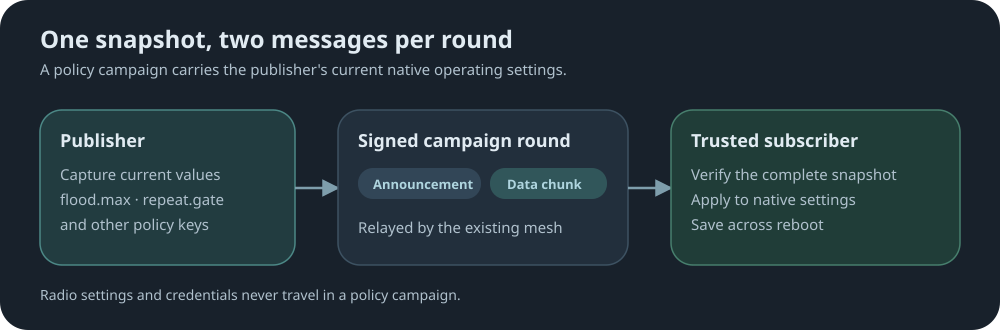

# Policy campaigns

[↩ Back to sync-settings readme](../README.md)

Part of [sync-settings](../README.md). Trusted publishers, channels, campaign mechanics and
monitoring are covered there.

A policy campaign carries the current values of selected native operating settings.



```text
flood.max              flood.max.unscoped     flood.max.advert
advert.interval        flood.advert.interval  path.hash.mode
loop.detect            multi.acks             af
txdelay                agc.reset.interval     repeat.gate
```

Radio settings and credentials are never carried by policy.

`repeat.gate` is aimed at room servers. A room server with repeat enabled ignores the region
list by default and repeats any flood; with `repeat.gate on` it respects the region list like a
repeater does.

| Command | What it does |
|---|---|
| `get repeat.gate` | Show whether a room server's repeats respect the region list. |
| `set repeat.gate <on\|off>` | Room servers: make repeats respect the region list, dropping floods whose region is unknown or flood-denied. Off by default. A repeater always respects it and only stores the value, so one policy applies cleanly to both. |

## Publishing

**Syntax:**

```text
sync.policy publish <region|*> <channel> [-raw]
```

| Argument | Meaning |
|---|---|
| `<region>` | A defined, flood-enabled region: the campaign floods only within that region. |
| `*` | Unscoped: the campaign floods everywhere wildcard flooding is allowed. |
| `<channel>` | The subscription channel receiving repeaters must match. |
| `-raw` | Send uncompressed. |

**Example**, unscoped on channel `release`:

```text
sync.policy publish * release
```

- The repeater's own current values are sent; set them locally first.
- The same pre-publish checks as regions apply.
- `-empty` does not apply to policy.

## Receiving

```text
sync.policy on
```

- Accepted values are written to the native settings and survive reboot.
- `sync.policy off` stops accepting campaigns; settings already applied stay applied.
- An interrupted policy apply is recovered at boot.

### Commands

| Command | What it does |
|---|---|
| `sync.policy on` | Accept policy campaigns. Requires a channel. |
| `sync.policy off` | Stop accepting campaigns; keep applied settings. |

Publishing schedule, `publish.reset`, abort and the shared command table:
[Region and policy publishing](../README.md#region-and-policy-publishing).

For status examples, report outcomes and hop tallies, see [Status and reports](status-and-reports.md).

[↩ Back to sync-settings readme](../README.md)
