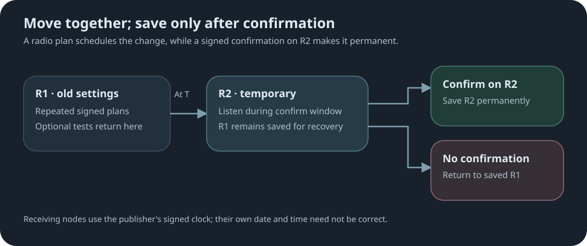

# Radio campaigns

Part of [sync-settings](../README.md). Trusted publishers, channels, campaign mechanics and
monitoring are covered there.

A radio campaign moves a mesh from its current LoRa settings, **R1**, to new ones, **R2**,
at a common time. Changing frequency, bandwidth or spreading factor cuts a node off from
the old mesh, so the move is announced repeatedly, optionally rehearsed, and made
permanent only after it is confirmed on R2.



The safety rule:

- a valid plan can move a repeater to R2 only temporarily;
- only a matching signed confirmation heard on R2 authorizes saving R2;
- without it, the repeater returns to its saved R1 settings automatically.

**Receiving repeaters do not need an accurate date or time.** Each plan carries the
publisher's signed clock, and every repeater counts from it on its own internal timer. The
whole mesh still cuts over together, even when a repeater's clock is unset or wrong by days,
months or more.

A failed migration needs no rollback: nodes that never confirmed are already back on R1,
and a later reverse campaign can move confirmed nodes back.

## Publishing

**Set the schedule**, all values in minutes:

```text
set sync.radio.schedule 10m,0m,0m,360m,5m,45m
```

| Field | Default | Meaning |
|---|---|---|
| campaign | `10m` | Send a fresh plan every 10 minutes. |
| test-interval | `0m` | Time between rehearsals; `0m,0m` disables them. |
| test-window | `0m` | Length of each rehearsal on R2. |
| duration | `360m` | Cutover 6 hours after launch. |
| confirm-interval | `5m` | Send a confirmation on R2 every 5 minutes. |
| confirm-window | `45m` | Confirm for 45 minutes after cutover. |

**Arm, then launch.** Syntax:

```text
sync.radio publish.arm <region|*> <channel> <freq>,<bw>,<sf>,<cr> [@UTC]
sync.radio publish.go  <region|*> <channel> <freq>,<bw>,<sf>,<cr> [@UTC]
```

| Argument | Meaning |
|---|---|
| `<region>` | A defined, flood-enabled region: the campaign floods only within that region. |
| `*` | Unscoped: the campaign floods everywhere wildcard flooding is allowed. |
| `<channel>` | The subscription channel receiving repeaters must match. |
| `<freq>` | Target frequency in MHz. |
| `<bw>` | Target bandwidth in kHz. |
| `<sf>`, `<cr>` | Spreading factor and coding rate, as native `set radio`. CR `0` keeps each node's current coding rate. |
| `@UTC` | Optional cutover time, `@YYYY-MM-DDTHH:MMZ`, instead of launch plus duration. |

**Example**, unscoped on channel `release`, moving to 915 MHz / 125 kHz / SF8 and keeping CR:

```text
sync.radio publish.arm * release 915,125,8,0
sync.radio publish.go  * release 915,125,8,0
```

- `publish.arm` validates and previews the plan; it writes and transmits nothing.
- `publish.go` must repeat the armed plan exactly.
- The arm lives in RAM only and expires after six hours; reboot, abort or replacement
  also clears it.

**While it runs:**

- Every round carries the same migration, target and cutover; a late round never postpones
  a test or the cutover.
- The repeater moves to R2 at cutover even if its own radio already matches.
- It saves R2 only after at least one confirmation has actually been transmitted on R2.
- Publishing does not require `sync.radio on`.

**Cancel** with `sync.radio publish.abort`:

- before cutover the cancellation goes out on R1; during confirmation, on R2;
- two notices, 30 seconds apart, must be transmitted before the campaign ends;
- once saving R2 begins, cancellation is too late.

### Commands

| Command | What it does |
|---|---|
| `get sync.radio.schedule` | Show the six timing values. |
| `set sync.radio.schedule <campaign>,<test-interval>,<test-window>,<duration>,<confirm-interval>,<confirm-window>` | Save campaign timing. |
| `sync.radio publish.arm <region\|*> <channel> <freq>,<bw>,<sf>,<cr> [@UTC]` | Validate and preview a plan. |
| `sync.radio publish.go <region\|*> <channel> <freq>,<bw>,<sf>,<cr> [@UTC]` | Start the exact armed plan. |
| `sync.radio publish.abort` | Cancel an active migration, sending or receiving, before commit. |

## Receiving

```text
sync.radio on
```

Requires a channel and at least one trusted publisher.

- A complete plan is staged while the node stays on R1.
- No accurate date or time is needed: tests and cutover are timed from the publisher's
  signed clock, not the local one.
- Rehearsals move to R2 and always return to R1 without saving.
- At cutover the node moves to R2 temporarily and saves it only after a matching
  confirmation for the same migration.
- A CR-only change waits until cutover, then saves and reboots with no confirmation step.
- A reboot before cutover discards the staged plan; the node stays on R1.
- `sync.radio off` or a received cancellation ends a migration before commit and returns
  the node to R1.
- Repeaters that support radio sync show `📡` in their owner info. `📻` replaces it while
  an active radio campaign is waiting for cutover.

### Commands

| Command | What it does |
|---|---|
| `sync.radio on` | Accept radio plans. Requires a channel and trusted publisher. |
| `sync.radio off` | Stop accepting plans; cancel a pending migration before commit. |
| `sync.radio publish.abort` | Cancel an active migration, sending or receiving, before commit. |

## Monitoring

| Command | What it does |
|---|---|
| `sync.radio publish.status` | Show phase, R1 or R2, channel and cutover time. |
| `sync.radio publish.report [page]` | Show the latest result: `committed`, `identical`, `cr-only`, `fallback`, `aborted` or `fault`. |

Unlike region and policy campaigns, a radio campaign's status and reports show identical
information on both the publisher's and the receiver's side. See
[Campaign Feedback and Reports](../README.md#campaign-feedback-and-reports).
