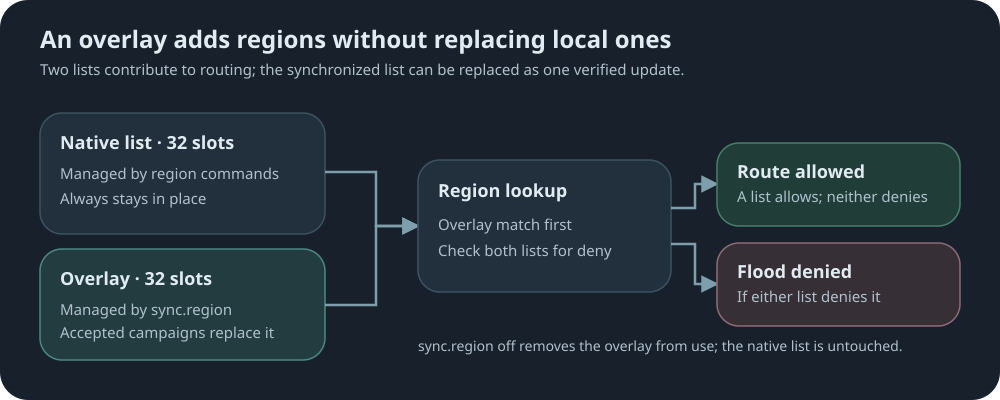

# Region campaigns

[↩ Back to sync-settings readme](../README.md)

Part of [sync-settings](../README.md). Trusted publishers, channels, campaign mechanics and
monitoring are covered there.

Region naming conventions and recommended settings are still evolving.
As they change, each repeater operator has to keep up: finding the latest guidance,
updating settings, and sometimes figuring out why a connection that worked yesterday
no longer works today. Across a whole mesh, that becomes a lot of maintenance.

A region campaign carries a managed region list—an **overlay**—across the mesh to every
sync-enabled repeater. This non-destructive overlay sits alongside the native region list,
effectively doubling its capacity without replacing it.

- The native and overlay lists each provide 32 region slots.
- Overlay matches take priority; a matching deny in either list wins.
- Traditional `region` commands manage the existing local list.
- Dedicated but similar `sync.region` commands manage the synchronized overlay.
- Room servers support overlay lookups; native forwarding behavior stays unchanged.



## Publishing

**Syntax:**

```text
sync.region publish <region|*> <channel> [-empty] [-raw]
```

| Argument | Meaning |
|---|---|
| `<region>` | A defined, flood-enabled region: the campaign floods only within that region. |
| `*` | Unscoped: the campaign floods everywhere wildcard flooding is allowed. |
| `<channel>` | The subscription channel receiving repeaters must match. |
| `-raw` | Send uncompressed. |
| `-empty` | Publish an empty overlay; see below. |

Flags can be combined, in any order.

**Build and send the overlay:**

```text
sync.region put us
sync.region put us-al us
sync.region put us-fl us
sync.region save
sync.region publish * release
sync.region publish.status
```

`sync.region` mirrors MeshCore's native `region` command but edits the overlay records.

- Edits are RAM-only until `save`.
- Limits: 32 public entries, 30-character names, seven hierarchy levels; no required root.
- `put` and `def` enable flooding; use `denyf` afterward if needed. A leading `#` is removed.
- Remote destructive edits may be deferred until after the reply; save may briefly return busy.

**Compact hierarchy:**

```text
sync.region def us us-al|us us-fl
```

Result: `us` with children `us-al` and `us-fl`. Each token descends a level; `|us`
selects `us` as the next parent. Comma also works.

**Before publishing:**

- Radio settings must match and the mesh path must be usable.
- The clock must be valid.
- `*` requires native wildcard flooding to be allowed.
- A named route requires a locally flood-enabled region match.

**Compression.** A region table is usually repetitive, so it is compressed when that saves
air-time. A full 32-entry table goes out in 5 frames per round instead of 13:

```text
sync.region publish * release
  -> OK - deflated 280 B, 5 frames per round
```

- Compression is chosen only when it saves a whole chunk, not merely bytes.
- Compressing needs PSRAM; boards without it publish uncompressed automatically. The Heltec V4 supports compression.
- `-raw` forces the uncompressed format for one campaign.

**Clear the overlay on every receiving repeater**—explicit confirmation required:

```text
sync.region publish * release -empty
```

The publisher's overlay must already be empty. `-empty` confirms that publishing it is
intentional; receiving repeaters clear their managed overlays and keep their native lists.

`publish.reset` is for generation-history recovery, not clearing regions. If that recovery
also needs to distribute an empty overlay, use:

```text
sync.region publish.reset * release -empty
```

### Commands

| Command | What it does |
|---|---|
| `sync.region [offset]` | Show the RAM overlay as an indented tree; follow the final `next <offset>` line for more. `F` means flood-enabled. |
| `sync.region put <name> [<parent>]` | Add or update a flood-enabled entry. Parent must exist; omission means top level. |
| `sync.region def <token> [<token> ...]` | Define a hierarchy in compact MeshCore-style notation. |
| `sync.region allowf <name>` | Allow flooding for an existing entry. |
| `sync.region denyf <name>` | Deny flooding for an existing entry. |
| `sync.region remove <name>` | Remove an entry; remove children first. |
| `sync.region save` | Save RAM edits; warns about incoming overwrites while sync is on. |
| `sync.region clear` | Empty the RAM list; `save` makes it permanent. |
| `sync.region reload` | Discard RAM edits and reload the saved list. |

## Receiving

```text
sync.region on
```

- Each accepted campaign replaces the whole overlay; the old overlay stays active until the
  replacement is complete and verified.
- Accepted campaigns save automatically.
- Compressed campaigns need no setting; a decompression failure appears in `publish.report`.
- Local `sync.region` edits also affect routing while sync is on, and the next accepted
  campaign replaces them.
- `sync.region off` removes the overlay from use and cancels inbound reception. Nothing in
  the native list is overwritten.

### Commands

| Command | What it does |
|---|---|
| `sync.region on` | Use the overlay and accept region campaigns. Requires a channel. |
| `sync.region off` | Use native regions only; cancel inbound reception. |

Publishing schedule, `publish.reset`, abort and the shared command table:
[Region and policy publishing](../README.md#region-and-policy-publishing).

For status examples, report outcomes and hop tallies, see [Status and reports](status-and-reports.md).

[↩ Back to sync-settings readme](../README.md)
