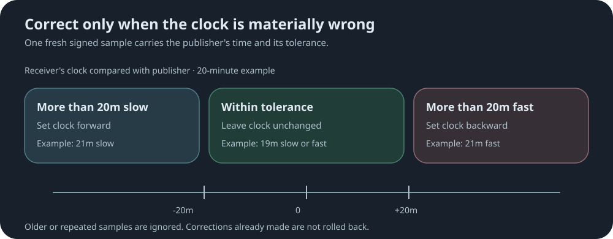

# Time campaigns

[↩ Back to sync-settings readme](../README.md)

Part of [sync-settings](../README.md). Trusted publishers, channels, campaign mechanics and
monitoring are covered there.

A repeater with no battery-backed clock can lose the date entirely, and one left running for
months can drift. A time campaign lets a trusted publisher repair clocks that are **materially
wrong**, in either direction.

- The publisher's clock is authoritative.
- A receiving repeater changes its clock only when it differs from the publisher by more than
  the publisher's **tolerance** (20 minutes unless changed).
- This is coarse date and time repair, not precision time: flood and relay delay of a few
  seconds is expected and ignored.



Each sample is one signed frame. Unlike region and policy campaigns there is nothing to
reassemble, and nothing to roll back: an accepted correction stands.

## Publishing

**Syntax:**

```text
sync.time publish <region|*> <channel>
```

| Argument | Meaning |
|---|---|
| `<region>` | A defined, flood-enabled region: samples flood only within that region. |
| `*` | Unscoped: samples flood everywhere wildcard flooding is allowed. |
| `<channel>` | The subscription channel receiving repeaters must match. |

**Example**, unscoped on channel `release`, sampling weekly for six months:

```text
set sync.time.tolerance 20m
set sync.time.publish.interval 7d
set sync.time.publish.duration 180d
sync.time publish * release
```

- One sample goes out immediately, then one every interval until the duration ends.
- The schedule survives a reboot. A publisher that was off for several intervals sends one
  fresh sample, never a burst to catch up.
- Tolerance and interval are captured when you publish; changing them affects the next
  `sync.time publish`, not a running one.
- Publishing does not require `sync.time on`.
- `sync.time publish.abort` stops future samples on this repeater only. Nothing is sent to
  receiving repeaters, and corrections they already made stand.

**The publisher's own clock.** Every sample carries the publisher's clock, so that clock must
be right.

- **With a proven hotspot** (Heltec V4, after one successful `ota wan verify`), the
  publisher refreshes its clock by NTP before sampling.
- **Refresh schedule:** `set sync.time.ntp.interval 7d` (default) refreshes on the first
  sample, then on the first sample at or after every 7 days. `0` refreshes every sample.
  Failed refreshes retry on the next sample. See the table below for examples.
- **Without a proven hotspot**, samples use the clock as it stands. Set it first with `time`
  or `ota wan verify`.
- **Clock changes** during a schedule move the schedule with them.
- **After a power loss** the clock resets. With the hotspot the publisher refreshes it before
  resuming; without it the schedule waits until the clock is set.

NTP refresh days over 30 days, with the schedule starting on day 1:

| Sample interval | NTP interval | Refreshes | Days |
|---|---|---:|---|
| 1d | 7d | 5 | 1, 8, 15, 22, 29 |
| 2d | 6d | 6 | 1, 7, 13, 19, 25, 31 |
| 2d | 7d | 5 | 1, 9, 15, 23, 29 |
| 3d | 7d | 5 | 1, 10, 16, 22, 31 |
| 7d | 14d | 3 | 1, 15, 29 |

An NTP interval that is a multiple of the sample interval gives evenly spaced refreshes.

**After a restart.** A running schedule survives a restart; what happens next depends on
whether the clock survived too. A software restart usually keeps it; a power loss or brownout
resets it to May 2024.

| Restart | With the hotspot check | Without it |
|---|---|---|
| Clock kept | Resumes at once. The next due sample refreshes the clock first, then the NTP calendar continues. | Resumes at once from the local clock. |
| Clock reset | Shows `waiting-clock`, refreshes the clock straight away, then resumes. A failed refresh is retried after 10 minutes, doubling each time up to the NTP interval. | Shows `waiting-clock` and sends nothing until the clock is set. |

- Deadlines never move because of the restart, and missed samples collapse into one.
- A schedule whose end passed during the outage closes without sending.
- A clock that comes back wrong in the forward direction cannot be detected.

### Commands

| Command | What it does |
|---|---|
| `get sync.time.tolerance` | Show the tolerance placed in outgoing samples. |
| `set sync.time.tolerance <N>m` | Save tolerance: 1–1440 minutes. |
| `get sync.time.publish.interval` | Show the sample interval. |
| `set sync.time.publish.interval <N>h\|<N>d` | Save interval: 1 hour to 30 days, never longer than the duration. |
| `get sync.time.publish.duration` | Show how long a schedule runs. |
| `set sync.time.publish.duration <N>d` | Save duration: 1–365 days. |
| `get sync.time.ntp.interval` | Show how often the hotspot clock refresh runs. |
| `set sync.time.ntp.interval <N>h\|<N>d\|0` | Save it: 1 hour to 365 days, or 0 for every sample. Takes effect on the next sample. |
| `sync.time publish <region\|*> <channel>` | Start a schedule. |
| `sync.time publish.abort` | Stop this repeater's schedule. |

## Receiving

```text
sync.time on
```

Requires a channel. Every [trusted publisher](../README.md#trusted-publishers) gains the
authority to correct this repeater's clock while `sync.time on` is set.

- A receiving repeater does not need an accurate clock to start with. An unset clock, or one
  wrong by years, is simply corrected.
- Each sample is checked for channel, trusted publisher and signature, and must be newer than
  the last one accepted from that publisher. Older or repeated samples are ignored.
- Samples are ignored while a radio campaign is in progress.
- `sync.time off` stops accepting samples; it does not undo a correction.
- `sync.publisher forget` also removes that publisher's time replay protection.

### Commands

| Command | What it does |
|---|---|
| `sync.time on` | Accept time samples. Requires a channel. |
| `sync.time off` | Stop accepting samples. |

## Monitoring

| Command | What it does |
|---|---|
| `sync.time publish.status` | Show on/off, whether a schedule is active with its next and final sample times, and the last received sample. |

For status words and received-sample results, see [Status and reports](status-and-reports.md#time-status).

[↩ Back to sync-settings readme](../README.md)
