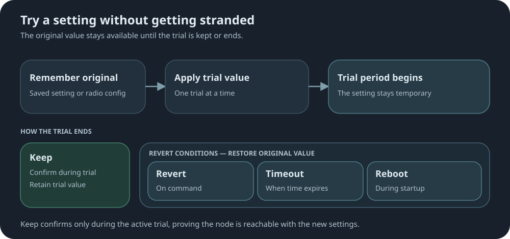

# try-settings

`tryset <secs> <key> <value>` applies a setting, then puts it back unless you confirm with
`tryset keep`. It is for settings that can make a node unreachable, or whose value can only be
judged at the site where the node is deployed.

MeshCore itself already owns the radio-parameter case: its `tempradio` applies `freq,bw,sf,cr` live,
reverts on its own timer, and writes nothing to prefs, so a reboot mid-trial restores the saved
config. This mod covers what `tempradio` does not.



## Example trial

Try a transmit-power setting for five minutes, then check that the node still answers:

```text
tryset 300 tx 14
tryset
```

While the trial is active, run `tryset keep` to retain the setting or `tryset revert` to
restore the original value. If the node becomes unreachable, the trial expires and restores
the original value automatically. A reboot also reverts the trial.

## CLI Commands

Detailed syntax, responses, and restrictions are in the
[CLI reference](docs/cli-additions.md).

| Command | What it does |
|---|---|
| `tryset <secs> <key> <value>` | Snapshot, apply, and start the clock (60–86400 seconds). |
| `tryset <secs> radio f,bw,sf,cr` | Start a radio trial through MeshCore's `tempradio`. Duration must be whole minutes. |
| `tryset keep` | Keep the running trial's value. |
| `tryset revert` | Restore the original value now. |
| `get tryset` | Show the active trial and its remaining time. |

## Keys

| Valid key | What the trial changes |
|---|---|
| `tx` | LoRa transmit power |
| `radio.rxgain` | Radio chip receive gain |
| `radio.fem.rxgain` | External FEM receive gain, where supported |
| `radio.fem.txgain` | External FEM transmit gain, where supported |
| `int.thresh` | Local interference threshold |
| `cad` | Channel Activity Detection before transmitting |
| `agc.reset.interval` | Receiver AGC reset interval |
| `flood.max` | Maximum flood hops |
| `flood.max.unscoped` | Maximum hops for unscoped floods |
| `flood.max.advert` | Maximum hops for advert floods |
| `repeat` | Message forwarding |
| `dutycycle` | Transmit duty-cycle limit |
| `radio` | Frequency, bandwidth, spreading factor, and coding rate through `tempradio` |

## Trial behavior

**A reboot ends a trial, it never resumes one.** An unscheduled restart is most likely a
brownout, and the trial's countdown does not survive a restart. A slot found at boot is
reverted, not resumed. The countdown runs on the node's uptime, not its clock, so setting or
correcting the clock during a trial neither shortens nor extends it.

**`tryset keep` requires an active trial for every key.** Confirming during the trial shows
that the node is still reachable with the new setting. After a revert, start another trial
before trying to keep it.

## Per-board keys

`radio.fem.*` exists only where the board can control the FEM (`fem_lna_control`). MeshCore
answers `Error: unsupported` on both the read and the write there, so the snapshot fails and the
trial is declined -- one binary serves every variant.

`radio.rxgain` needs its own care: MeshCore saves the pref *before* testing whether the board
supports it, so a failed apply is followed here by an explicit restore rather than left as-is.
